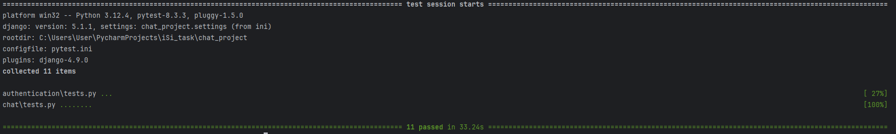

# Chat and Message API Project

This project implements a simple chat application with two models: `Thread` and `Message`. Each thread contains up to two participants, and messages can be exchanged within these threads.

## Features

- **Thread Management**: 
  - Create threads between two participants.
  - Return an existing thread if participants are the same.
  - Delete threads.
  - Retrieve all threads for a specific user.
  
- **Message Management**:
  - Send messages within a thread.
  - Retrieve all messages from a thread.
  - Mark messages as read.
  - Count unread messages.

## Installation

### Prerequisites

- Python 3.8+
- PostgreSQL or SQLite (SQLite is used by default for testing)
- Django 4.x
- Django REST Framework
- Pytest for testing

### Clone the repository

```bash
git clone https://github.com/n-varvonets/iSi_task
cd chat-project
```

### Create a virtual environment and activate it

```bash
python -m venv venv
source venv/bin/activate  # On Windows use `venv\Scripts\activate`
```

### Install dependencies

```bash
pip install -r requirements.txt
```

### Set up the database

By default, the project uses SQLite for simplicity. If you'd like to use PostgreSQL, update the `DATABASES` setting in `chat_project/settings.py`.

To create the necessary database schema, run migrations:

```bash
python manage.py migrate
```


## API Endpoints

Here are some key API endpoints:

- `POST /api/auth/register/`: Register a new user.
- `POST /api/auth/token/`: Get JWT token by providing email and password.
- `POST /api/chat/threads/`: Create a new chat thread between two participants.
- `GET /api/chat/threads/user_threads/`: Retrieve all chat threads for the authenticated user.
- `POST /api/chat/messages/`: Send a message in a thread.
- `GET /api/chat/threads/<thread_id>/messages/`: Get all messages in a thread.
- `POST /api/chat/messages/<message_id>/mark_as_read/`: Mark a specific message as read.
- `GET /api/chat/messages/unread/`: Get the number of unread messages for the authenticated user.

## Additional Information

- The project uses **DRF** (Django REST Framework) for building API endpoints.
- **Pytest** is used for testing, and **Django Test Fixtures** are used for loading test data.
- Authentication is handled with **JWT tokens** (provided by Django REST Framework SimpleJWT).

## Database Dump

A dump of the database with initial data for testing is located at `chat_project/fixtures/db_dump.json`.
## Running Tests

To run the tests, use the following command:

```bash
pytest
```

## Passed Tests

Here is the list of tests that successfully passed:

### Authentication Tests:

1. **test_successful_registration**: Tests that a user can register and receive JWT tokens.
2. **test_registration_with_existing_email**: Tests that registering with an existing email fails.
3. **test_successful_login**: Tests that a user can log in and receive JWT tokens.

### Chat/Thread Tests:

1. **test_create_thread_with_same_participant_twice**: Tests that a thread cannot be created with the same participant ID twice.
2. **test_create_thread_with_existing_participants**: Tests that if a thread with the same participants exists, it is returned instead of creating a new one.
3. **test_create_thread_with_more_than_two_participants**: Tests that creating a thread with more than two participants fails.
4. **test_get_user_threads**: Tests that a user can retrieve all threads they are part of.
5. **test_delete_thread**: Tests that a user can delete a thread.

### Message Tests:

1. **test_send_message_with_user_not_in_thread**: Tests that a user not in the thread cannot send a message.
2. **test_get_unread_messages_count**: Tests that a user can retrieve the number of unread messages.
3. **test_mark_message_as_read**: Tests that a user can mark a message as read.


### After passing test you can see such results of test




